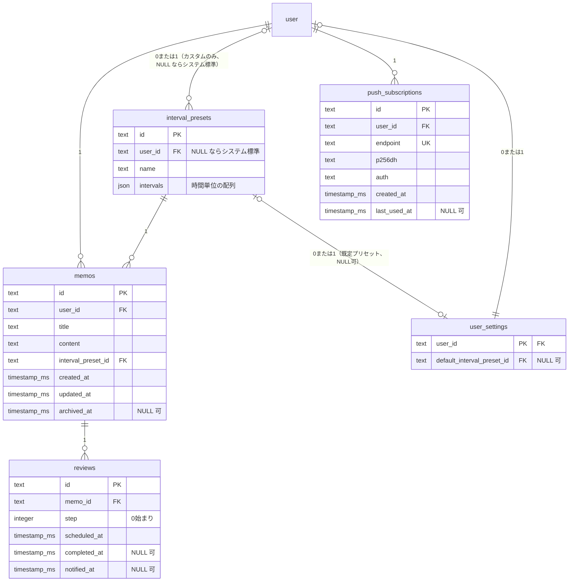

# DB スキーマ設計 (#12)

`packages/db/src/schema.ts` で定義するテーブルの意図と設計判断をまとめる。
Better Auth が生成する `user` / `session` / `account` / `verification` / `rate_limit`
（`packages/db/src/auth-schema.ts`、手動編集しない）は対象外。

## ER 図

`interval_presets` と `user` の関係だけ `user` 側の crow's foot が `|o`（0 または 1）
である点に注意（mermaid の erDiagram では左右でトークン表記が異なり、`user` 側=左は
`|o`、`interval_presets` 側=右なら `o|` になる）。`user_id` が NULL 許容
（システム標準プリセット）なのはこの関係だけで、他の4本（`memos`/`push_subscriptions`/
`reviews` 側の FK）はすべて `NOT NULL` なので `||`。

## テーブルごとの意図

### `interval_presets`

復習間隔のプリセット。`user_id` が `NULL` の行は**システム標準プリセット**（短期集中 /
標準 / 長期）、値が入っている行はユーザーのカスタムプリセット。`intervals` は
時間単位の間隔配列（例 `[1, 6, 24, 72]`）を JSON で持つ
（`text(..., { mode: 'json' }).$type<number[]>()`）。

**システム標準プリセットの実データ投入（seed）はこの Issue のスコープ外にした。**
`interval_presets` に `user_id: null` の行を用意するテーブル形状の定義までがこの
Issue の責務で、実際の3プリセットの値と、それを固定 slug の `id`（`system-short` /
`system-standard` / `system-long`）で INSERT する処理は #15 の「システム標準
プリセットを定義」に委ねた。理由: #15 は `packages/core` に `nextReviewAt` 等の
計算ロジックとあわせてプリセット値そのものを決める Issue であり、値の出所を1箇所
（#15 の `packages/core/src/index.ts` の `SYSTEM_INTERVAL_PRESETS`）に保つため。
ランダム生成だと環境（local / production）ごとに `id` がずれ、アプリ側が
「標準プリセット」を安定して参照できないため、固定 slug の `id` を使っている
（`crypto.randomUUID()` の既定値は上書きされる）。

**seed は #15 で完了した**（`packages/db/migrations/0007_seed_remaining_system_interval_presets.sql`）。
「標準」（`system-standard`）は #14 が migration `0006` で暫定的に先行投入していたため
そのまま維持し、残りの「短期集中」（`system-short`）「長期」（`system-long`）を
#15 で追加投入した（詳細は `docs/design-decisions.md` の #15 節を参照）。

### `memos`

メモ本体。`interval_preset_id` は必須（メモは常にどれかのプリセットに従う）。
`archived_at` はソフトアーカイブ用（削除ではなく非表示化）。

`interval_preset_id` の FK には `onDelete` を指定していない（既定 = `no action`）。
使用中のプリセットを誤って削除させないための意図的な選択で、プリセット管理 UI（#18）
側で「使用中なら削除不可」を扱う前提。`no action` の制約チェック（プリセット削除時に
参照している memos が存在するかの検索）と、#18 の「使用中判定」自体がこのカラムで
検索するため、`memos_intervalPresetId_idx` を張った（SQLite は FK に自動で索引を
張らない。`reviews_memoId_idx` と同じ理由だが、こちらは `no action` であり
カスケード削除の効率化ではない点に注意）。

**テナント分離はトリガーで強制する**: `memos.interval_preset_id` は「同じユーザーの
カスタムプリセット、またはシステム標準プリセット（`interval_presets.user_id IS NULL`）」
のみを指すべきだが、FK は「参照先が存在するか」しか見ないため、他ユーザーの custom
プリセットを参照する行も FK 上は素通りしてしまう（複合 FK 相当のチェックが必要）。
最初は「アプリ層で検証すること」という申し送りのみにしていたが、レビューで
「アプリ層に倒すと、書き漏らし・リトライ・メンテナンスクエリなど、あらゆる書き込み
経路で bypass されうる」と指摘され、`memos` への `BEFORE INSERT` / `BEFORE UPDATE
OF interval_preset_id, user_id` トリガー（`0004_memos_interval_preset_owner_trigger.sql`）
で DB 層に強制するよう変更した。トリガーは
`interval_presets.user_id IS NULL OR interval_presets.user_id = NEW.user_id`
を満たさない行の INSERT/UPDATE を `RAISE(ABORT, ...)` で拒否する。同一ユーザーの
参照・システムプリセットの参照・他ユーザーの参照拒否・UPDATE 経由での拒否の
4パターンを実機（ローカル D1）で確認済み（後述）。
`interval_presets.user_id`（プリセットの所有者）を後から付け替える操作は現時点で
どの Issue にも存在しないため、そちらのトリガーは追加していない（#18 で
プリセットの譲渡のような機能を追加する場合は改めて検討すること）。

### `reviews`

1メモ・1ステップにつき1行。**メモ作成時に全ステップ分をまとめてバッチ生成する**方針
とした（#16 に指示）。

根拠: #18 の受け入れ条件に「変更の影響範囲をユーザーに明示する（『N 件の予定が
更新されます』）」とあり、これは未完了の予定が複数件存在する前提の文言。都度生成
（未完了行が常に1件）なら「N件」という表現は意味を持たない。

再計算（#18）の実装指示: 間隔プリセットを変更したら
`DELETE FROM reviews WHERE memo_id = ? AND completed_at IS NULL` で未完了分を削除し、
完了済みステップ数を起点に新しい `intervals` から残りステップを再生成する。
完了済み（`completed_at IS NOT NULL`）の行には触れない。

**このレシピは「ステップが 0, 1, 2, ... の順に、欠番なく完了する」ことを前提にしている。**
`step` が `intervals` 配列を引く 0 始まりインデックスである一方、`reviews` テーブルにも
アプリ層にも「`completed_at` は step の昇順にのみ設定される」という不変条件は明示されて
いない。仮に #17 が「期限が来ている分から任意の順で完了できる」UI にした場合、
例えば step=0 と step=2 が完了済みで step=1 が未完了のまま残る状態
（完了済み件数=2）で本レシピを適用すると、新規行が step=2 から採番され、既存の
完了済み step=2 行と衝突して `reviews_memoId_step_unique` に違反する。
**決定オーナーは #17 とする**: 「常に最小の未完了 step から完了させる」という
不変条件を #17（復習の完了操作）側で明示的に定め、保証すること。この不変条件が
守られる限り、#18 の再計算レシピ（「完了済みステップ数を起点に」）はそのまま
正しく動作する。#17 がこの制約を受け入れられない場合（任意の順で完了させたい場合）
に限り、#18 側で「完了済み件数」ではなく「既存の完了済み step の集合から見た
次の空き番号」を使うように再計算ロジックを設計し直すこと。

（#17 は実際にこの不変条件を保証している。`assertIsCurrentStep` が完了・詳細取得の
両方で「常に最小の未完了 step」を再検証するため、#18 の再計算レシピはそのまま
「完了済みステップ数を起点に」で実装した。詳細は `docs/design-decisions.md` の
#18 節を参照。）

**#18 が別途決めていた2つのエッジケースは、いずれもユーザー承認済みの判断で解消済み**:
- 新プリセットの要素数が既存の完了済みステップ数以下になる場合（例: 完了済み3ステップの
  後に4ステップ→2ステップのプリセットへ変更）は、残りステップを生成せず**そのメモを
  全ステップ完了扱いにする**（エラーにはしない）。
- プリセット**編集後**（`intervals` の in-place 編集）は、そのプリセットを使っている
  **全ての非アーカイブメモへ同じ再計算レシピを適用する**（「編集不可にし削除・新規作成のみ
  許可する」案は採らなかった）。

さらに、期限到来済み（`scheduled_at <= now`）の未完了行も特別扱いせず、他の未完了行と
同様に削除して作り直す（イシュー本文の「注意」が示唆していた「due 行は動かさない」案は
採らなかった。ユーザー承認済み）。baseTime は「最新の完了済みステップの `completed_at`
（無ければ `memos.created_at`）」とし、#17 の `completeReview` の再アンカリングと同じ
基準に揃えている。詳細・根拠は `docs/design-decisions.md` の #18 節を参照。

`unique(memo_id, step)` を追加した。バッチ生成・再計算時に同じステップを重複 INSERT
しないための制約（実機で `UNIQUE constraint failed` により重複拒否を確認済み）。

`(scheduled_at, completed_at)` に複合インデックスを追加した。#12 Issue 本文が
明示的に要求している唯一のインデックス（scheduler が毎分「期限到来かつ未完了」を
検索するため）。

**この複合インデックスだけでは完了済み行の蓄積でスキャンが劣化する**（レビューで
指摘）。`scheduled_at` が先頭の範囲条件のため、後続の `completed_at` では絞り込めず、
`notified_at` はインデックスに含まれてすらいない。完了済み `reviews` は削除されず
履歴として残り続ける方針（このドキュメントのどこにも「削除する」とは書いていない）
のため、時間が経つほど scheduler のクエリはこのインデックス上で完了済み行を
読み飛ばす量が増えていく。対策として `reviews_pending_scheduledAt_idx`
（`scheduled_at` に対する部分インデックス、`WHERE completed_at IS NULL AND
notified_at IS NULL`）を追加した。未完了・未通知の行だけを持つため、完了済み履歴の
量に関係なく件数が一定に保たれる。scheduler の実クエリ（後述）がこちらの部分
インデックスを使うことを `EXPLAIN QUERY PLAN` で確認済み。
`(scheduled_at, completed_at)` の複合インデックス自体は #12 Issue 本文の明示的な
要求のため残しており、完了済みも含めた履歴の時系列クエリ（復習履歴一覧、#17）
などで使われる想定。

`memo_id` 単体にも索引を追加（`reviews_memoId_idx`）。SQLite は FK に自動で索引を
張らないため、`ON DELETE CASCADE` によるカスケード削除の効率と、#17 の「1メモの
復習履歴一覧」用。

**#21 への申し送りは #16 で解消済み**: 当初 `memos.archived_at`（ソフトアーカイブ）は
`reviews` に一切伝播せず、「アーカイブ済みメモの reviews を `memos` との JOIN で除外する」か
「アーカイブ時に未完了 reviews を削除/無効化する」かを #21 が決める、としていた。#16 の
`archiveMemo`（`apps/web/src/lib/server/memos.ts`）が後者（削除する側）を採用し、
アーカイブと同じ `db.batch()` で未完了（`completedAt IS NULL`）の `reviews` を削除するよう
実装した（完了済みの行は履歴として残るため削除しない）。詳細は
`docs/design-decisions.md` の「メモ作成時の reviews 生成とアーカイブ時の削除 (#16)」節を参照。
#21 は「JOIN で除外するか削除するか」をこの2択で改めて検討する必要はない。ただし
この不変条件（アーカイブ済みメモに未完了 reviews が残らない）は `archivedAt` を書く経路が
`archiveMemo` のみであることに依存している。将来 `archivedAt` を書く別の経路（一括アーカイブ、
管理者操作等）を追加する場合は、そちらでも同様に未完了 reviews を削除するか、この前提が
崩れていないかを確認すること。

### `push_subscriptions`

1ユーザーが複数デバイスを持てる前提（#19）で `user_id` は複数行を許容し、
`endpoint` に**全ユーザー横断の**一意制約を張った（同じ購読の重複 INSERT を防ぐ、
Push 仕様上 endpoint は購読を一意に識別する）。

**#19 への申し送り**: 同じブラウザ/デバイスで別アカウントに切り替えて再購読すると
同じ `endpoint` が返ることがあり得る。その場合 `INSERT` はこの一意制約に単純に
失敗するため、#19 は `endpoint` を鍵にした upsert（既存行があれば `user_id` を
新しいユーザーに付け替える）で実装すること。単純な INSERT 失敗をそのままエラーに
すると、デバイス共有・アカウント切り替えのケースで購読が壊れる。

### `user_settings` (#18)

新規メモ作成時に使う既定プリセットをユーザーごとに持たせるためのテーブル。
`user_id` を主キー（1ユーザー1行）とし、`default_interval_preset_id` は
NULL 許容（一度も設定していないユーザーは行自体を持たない。フォールバックは
`apps/web/src/lib/server/interval-presets.ts` の `DEFAULT_INTERVAL_PRESET_ID`）。

`default_interval_preset_id` は `memos.interval_preset_id` と全く同じ
「他ユーザーの custom プリセットを指せてしまう」問題を持つため、
`0004_memos_interval_preset_owner_trigger.sql` と同型のトリガー
（`0009_user_settings_default_preset_owner_trigger.sql`）で DB 層にテナント分離を
強制する。一方 `onDelete` は `memos.interval_preset_id`（`no action`、使用中プリセットの
削除を防ぐ）とは異なり **`set null`** にした。既定プリセットとして参照されている
だけのカスタムプリセットの削除まで（`memos` の使用有無とは無関係に）ブロックすると
ユーザー体験上の驚きが大きいため、削除可否の判定は `memos.interval_preset_id` の
使用有無だけを見る（設定が黙ってシステム標準へフォールバックする方が、削除操作が
理由不明にブロックされるより分かりやすいと判断した。ユーザー承認済み）。

## 共通の設計判断

### ID 生成

このリポジトリにアプリ独自テーブルの ID 生成パターンはまだ存在しなかった
（`ping` は `autoincrement` の動作確認用で参考にならない）。全テーブル
`id: text('id').primaryKey().$defaultFn(() => crypto.randomUUID())` とした。
Better Auth 側のテーブルも `text` 主キーであることに合わせつつ、ID 生成用の
外部ライブラリ（nanoid 等）を増やさず Workers で使える `crypto.randomUUID()`
で完結させた。`$defaultFn` は明示的に値を渡した INSERT では使われないため、
システムプリセットの固定 slug ID とも両立する。

### タイムスタンプ

`auth-schema.ts` の規約（`integer(..., { mode: 'timestamp_ms' })` +
`` sql`(cast(unixepoch('subsecond') * 1000 as integer))` `` をデフォルトに持つ
`created_at`/`updated_at`）にすべて合わせた。同一 DB 内で秒/ミリ秒が混在すると
#21 のような日時比較を伴うクエリで事故るため。`scheduled_at` はアプリ側（#16）が
計算した絶対時刻を明示的に INSERT する前提でデフォルト値は持たせていない。

**`scheduled_at`/`completed_at`/`notified_at` はすべて UTC の絶対時刻（epoch
ミリ秒）で保存する**（#12 Issue 本文の設計上の決定事項どおり）。quiet hours を
設けない方針のため、タイムゾーンは表示時にのみ考慮すればよく、スキーマ側では
タイムゾーン情報を一切持たない。`integer(..., { mode: 'timestamp_ms' })` は
JS 側で `Date` との相互変換を行うのみで、値自体は常に UTC 基準の epoch。

### インデックス命名

`auth-schema.ts` の既存規約（`session_userId_idx` 等、`<実テーブル名>_<camelCase
カラム名>_idx`）に合わせ、テーブル名部分は JS の変数名ではなく実際の DB テーブル名
（snake_case）を使う。複合語テーブル（`interval_presets`/`push_subscriptions`）で
最初 JS 変数名の camelCase（`intervalPresets_userId_idx`）を使ってしまい、
drizzle-kit が自動生成する `push_subscriptions_endpoint_unique`（実テーブル名ベース）
と表記が食い違っていたレビュー指摘を受けて `interval_presets_userId_idx` /
`push_subscriptions_userId_idx` に修正した。

### `relations()` の設計

`auth-schema.ts` は生成ファイル（手動編集禁止）であり、`user` テーブルの
`relations(user, ...)` は既にそこで1回定義されている（`sessions`/`accounts`）。
`schema.ts` 側では `memos`/`intervalPresets`/`pushSubscriptions`（いずれも
`user_id` カラムを持つ）それぞれの `relations()` から `one(user, ...)` で参照する
のみとし、`user` に対する2つ目の `relations()` は追加していない。`reviews` は
`user_id` を持たず `memo_id` のみを参照するため、`user` への直接参照はそもそも無い
（`memo` を経由する）。

（検証メモ: インストール済み `drizzle-orm@0.45.2` の `relations.js`
（`extractTablesRelationalConfig`）を読むと、複数の `Relations` インスタンスは
リレーション名単位でマージされるため、キーが重複しなければ `user` に対する
2つ目の `relations()` を追加しても安全にマージされることを確認した。ただし
このスキーマ（#12）が要求されているのはテーブル・インデックス・マイグレーションの
定義までであり、user 起点の relational query（`db.query.user.findFirst({ with: {
memos: true } })` 等）を使えるようにする追加の relations 定義は本 Issue のスコープ
外と判断し、見送った。必要になれば #16 以降で追加すればよい。）

そのため `db.query.user.findFirst({ with: { memos: true } })` のような user 起点の
relational query は使えず、`db.select().from(memos).where(eq(memos.userId, ...))`
のように直接クエリする必要がある。

## 検証結果

- `pnpm db:generate`: `ping` の削除と新規4テーブルの追加を1つの diff で行うと
  drizzle-kit が「rename か」を対話式で確認しようとし非対話シェルで失敗する。
  当初は削除のみ・追加のみの2段階に分けて生成したが、レビューで「deploy
  ワークフローは migrate → deploy の順で実行するため、`ping` を DROP すると
  旧バージョンの scheduler/debug ページ（まだ `ping` を参照している）が、
  自身の deploy が完了するまでの間 `no such table: ping` で壊れる」と指摘された
  （`docs/design-decisions.md` の #7 節が明記する「破壊的マイグレーションは
  この順序前提を崩す」に該当）。**`ping` の DROP はこの PR に含めず、
  `packages/db/src/schema.ts` に `ping` のテーブル定義を残したまま新規4テーブルの
  追加だけを行う `0003_purple_hemingway.sql` を生成し直した**。`ping` は
  デプロイが完了し旧バージョンを参照するコードが無くなったことを確認できた
  後続 PR で改めて DROP する
- `0004_memos_interval_preset_owner_trigger.sql`（`drizzle-kit generate --custom`
  で作成、テナント分離のトリガー）と `0005_dear_reptil.sql`（`reviews` の
  部分インデックス）を追加で生成した
- `pnpm db:migrate:local`: ローカル D1 の状態を一度削除してゼロから
  `apps/web` と `apps/scheduler` の両方に適用できることを確認
  （別インスタンス、`docs/design-decisions.md` の #5 節を参照）。トリガー・
  部分インデックスを含む全マイグレーションの適用後に以下を再検証した
- FK カスケードが実際に有効（`PRAGMA foreign_keys` = 1）であることをローカルで確認。
  **本番 D1 でも同様に有効かは未確認**（この設定はランタイム既定値に依存し、
  ローカルの miniflare と本番 workerd で挙動が異なる可能性を排除できていない）
- `memos` を削除すると紐づく `reviews` が実際に削除されることを確認
  （挿入した2件が削除後に0件になることを `SELECT count(*)` で実測）
- より複雑なケース: `user` を削除すると、`memos`（→ `reviews` へさらにカスケード）と
  `interval_presets`（カスタムプリセット）が同時にカスケード対象になり、
  `memos.interval_preset_id` の FK（`no action`）が競合しないか懸念したが、
  実機で `DELETE FROM user` が成功し、`memos`/`interval_presets`/`reviews` の
  行数がいずれも 0 になることを `SELECT count(*)` で確認した
  （ユーザー・プリセット・メモ・レビューを1件ずつ挿入した状態からの削除）
- `reviews (memo_id, step)` の unique 制約が重複 INSERT を実際に拒否することを確認
  （`UNIQUE constraint failed: reviews.memo_id, reviews.step`）
- **テナント分離トリガーの実機確認**（2ユーザー・2プリセットを用意し、それぞれ
  独立したステートメントで検証。同一コマンド内の複数 INSERT は1トランザクションとして
  一括ロールバックされるため、成功/失敗のケースは分けて実行する必要があった）:
  - 自分のカスタムプリセットを参照する INSERT → 成功
  - システム標準プリセット（`user_id IS NULL`）を参照する INSERT → 成功
  - 他ユーザーのカスタムプリセットを参照する INSERT →
    `memos.interval_preset_id must reference a system preset or a preset owned
by the same user: SQLITE_CONSTRAINT (extended: SQLITE_CONSTRAINT_TRIGGER)`
    で拒否
  - 既存行の `interval_preset_id` を他ユーザーのプリセットに UPDATE → 同様に拒否
    （`BEFORE UPDATE OF interval_preset_id, user_id` トリガーが対象。これが無いと
    UPDATE 経由の書き換えは INSERT 用トリガーをすり抜けることも合わせて実機確認した）
- **部分インデックスの実機確認**: `EXPLAIN QUERY PLAN SELECT * FROM reviews WHERE
scheduled_at <= ? AND completed_at IS NULL AND notified_at IS NULL ORDER BY
scheduled_at LIMIT 20` が `SEARCH reviews USING INDEX
reviews_pending_scheduledAt_idx` を使うことを確認（旧 `EXPLAIN QUERY PLAN` は
  `reviews_scheduledAt_completedAt_idx` を使っていたが、部分インデックス追加後は
  こちらが選ばれるようになった）。未完了・未通知の行のみを持つインデックスのため、
  完了済み履歴が増えてもスキャン対象は増えない
- `pnpm format:check` / `pnpm lint`: 当初 `docs/schema.md` とマイグレーションの
  `meta/*.json` が未フォーマットで CI の必須チェックに失敗する状態だった
  （レビュー指摘）。`pnpm format` で解消し、`format:check` が通ることを確認した
- `pnpm check`（ルート）: 0 errors
- `pnpm db:migrate:remote`: このサンドボックスに `CLOUDFLARE_API_TOKEN` が無いため
  未実行（`docs/design-decisions.md` の #7 節どおり、本番適用は deploy ワークフロー
  が担当する）。したがって「マイグレーションが本番にも適用できる」という受け入れ条件は
  **未検証**。`ping` を DROP しない方針にしたことで、この PR のマイグレーションは
  純粋に追加的（後方互換）になっており、`docs/design-decisions.md` #7 節が前提とする
  migrate-then-deploy の順序を崩さない
