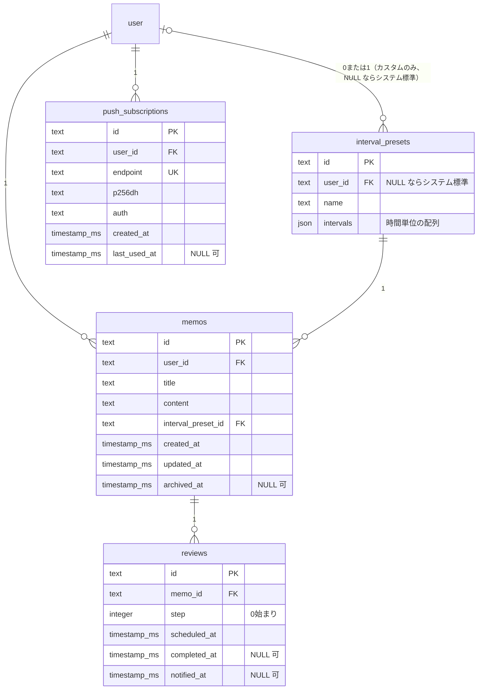

# DB スキーマ設計 (#12)

`packages/db/src/schema.ts` で定義するテーブルの意図と設計判断をまとめる。
Better Auth が生成する `user` / `session` / `account` / `verification` / `rate_limit`
（`packages/db/src/auth-schema.ts`、手動編集しない）は対象外。

## ER 図

`interval_presets` と `user` の関係だけ `user` 側の crow's foot が `|o`（0 または 1）
である点に注意（mermaid の erDiagram では左右でトークン表記が異なり、`user` 側=左は
`|o`、`interval_presets` 側=右なら `o|` になる）。`user_id` が NULL 許容
（システム標準プリセット）なのはこの関係だけで、他の4本（`memos`/`push_subscriptions`/
`reviews` 側の FK）はすべて `NOT NULL` なので `||`。

## テーブルごとの意図

### `interval_presets`

復習間隔のプリセット。`user_id` が `NULL` の行は**システム標準プリセット**（短期集中 /
標準 / 長期）、値が入っている行はユーザーのカスタムプリセット。`intervals` は
時間単位の間隔配列（例 `[1, 6, 24, 72]`）を JSON で持つ（`text(..., { mode: 'json' })`
+ `$type<number[]>()`）。

**システム標準プリセットの実データ投入（seed）はこの Issue のスコープ外にした。**
`interval_presets` に `user_id: null` の行を用意するテーブル形状の定義までがこの
Issue の責務で、実際の3プリセットの値と、それを固定 slug の `id`（例:
`system-short` / `system-standard` / `system-long`）で INSERT する処理は #15 の
「システム標準プリセットを定義」に委ねる。理由: #15 は `packages/core` に
`nextReviewAt` 等の計算ロジックとあわせてプリセット値そのものを決める Issue であり、
値の出所を1箇所（#15）に保つため。#15 で seed する際は固定 slug の `id` を使うこと
（`crypto.randomUUID()` の既定値は上書きされる）。ランダム生成だと環境（local /
production）ごとに `id` がずれ、アプリ側が「標準プリセット」を安定して参照できない。

### `memos`

メモ本体。`interval_preset_id` は必須（メモは常にどれかのプリセットに従う）。
`archived_at` はソフトアーカイブ用（削除ではなく非表示化）。

`interval_preset_id` の FK には `onDelete` を指定していない（既定 = `no action`）。
使用中のプリセットを誤って削除させないための意図的な選択で、プリセット管理 UI（#18）
側で「使用中なら削除不可」を扱う前提。`no action` の制約チェック（プリセット削除時に
参照している memos が存在するかの検索）と、#18 の「使用中判定」自体がこのカラムで
検索するため、`memos_intervalPresetId_idx` を張った（SQLite は FK に自動で索引を
張らない。`reviews_memoId_idx` と同じ理由だが、こちらは `no action` であり
カスケード削除の効率化ではない点に注意）。

**DB 層では強制できない不変条件**: `memos.interval_preset_id` は「同じユーザーの
カスタムプリセット、またはシステム標準プリセット（`interval_presets.user_id IS NULL`）」
のみを指すべきだが、SQLite/D1 の単純な FK では他テーブルの別カラムをまたいだ
整合性チェック（複合 FK 相当）ができない。他ユーザーの custom プリセットを
参照する行が作れてしまうため、**#16（メモ作成）と #18（プリセット選択 UI）は
アプリ層で `intervalPresets.userId === memos.userId OR intervalPresets.userId IS NULL`
を検証すること**。この検証を怠ると、参照先プリセットの所有者を削除しようとした際に
`no action` の FK 違反でユーザー削除自体が失敗する不具合につながる。

### `reviews`

1メモ・1ステップにつき1行。**メモ作成時に全ステップ分をまとめてバッチ生成する**方針
とした（#16 に指示）。

根拠: #18 の受け入れ条件に「変更の影響範囲をユーザーに明示する（『N 件の予定が
更新されます』）」とあり、これは未完了の予定が複数件存在する前提の文言。都度生成
（未完了行が常に1件）なら「N件」という表現は意味を持たない。

再計算（#18）の実装指示: 間隔プリセットを変更したら
`DELETE FROM reviews WHERE memo_id = ? AND completed_at IS NULL` で未完了分を削除し、
完了済みステップ数を起点に新しい `intervals` から残りステップを再生成する。
完了済み（`completed_at IS NOT NULL`）の行には触れない。

**このレシピは「ステップが 0, 1, 2, ... の順に、欠番なく完了する」ことを前提にしている。**
`step` が `intervals` 配列を引く 0 始まりインデックスである一方、`reviews` テーブルにも
アプリ層にも「`completed_at` は step の昇順にのみ設定される」という不変条件は明示されて
いない。仮に #17 が「期限が来ている分から任意の順で完了できる」UI にした場合、
例えば step=0 と step=2 が完了済みで step=1 が未完了のまま残る状態
（完了済み件数=2）で本レシピを適用すると、新規行が step=2 から採番され、既存の
完了済み step=2 行と衝突して `reviews_memoId_step_unique` に違反する。
**決定オーナーは #17 とする**: 「常に最小の未完了 step から完了させる」という
不変条件を #17（復習の完了操作）側で明示的に定め、保証すること。この不変条件が
守られる限り、#18 の再計算レシピ（「完了済みステップ数を起点に」）はそのまま
正しく動作する。#17 がこの制約を受け入れられない場合（任意の順で完了させたい場合）
に限り、#18 側で「完了済み件数」ではなく「既存の完了済み step の集合から見た
次の空き番号」を使うように再計算ロジックを設計し直すこと。

**#18 が別途決めるべきもう一つの未解決のエッジケース**: 新プリセットの要素数が
既存の完了済みステップ数以下になる場合（例: 完了済み3ステップの後に
4ステップ→2ステップのプリセットへ変更）、「そのメモは全ステップ完了扱いにする」のか
「エラーにする」のかをこのスキーマは決めていない。#18 の実装時に判断すること。

**#15/#18 への申し送り（根本原因の統合）**: 上記2つのエッジケースは、どちらも
「`reviews.step` は `interval_presets.intervals` を **id 越しに参照する可変な配列**の
インデックスであり、生成時点の値のスナップショットを持たない」という同一の設計上の
性質に由来する。プリセットを**切り替える**場合（`memos.interval_preset_id` の変更、
上記のレシピが対象）だけでなく、**同じカスタムプリセットの `intervals` 自体を
in-place で編集する**場合（#18 のプリセット編集 UI）も同様の問題を引き起こす。
そのプリセットを使っている全メモの既存 `step` が指す意味が黙って変わってしまうため、
#18 は「プリセット作成後は `intervals` を編集不可にし、削除・新規作成のみ許可する」か、
「`intervals` の編集時にも影響する全メモへ上記と同じ再計算を適用する」かを決めること。

`unique(memo_id, step)` を追加した。バッチ生成・再計算時に同じステップを重複 INSERT
しないための制約（実機で `UNIQUE constraint failed` により重複拒否を確認済み）。

`(scheduled_at, completed_at)` に複合インデックスを追加した。#12 Issue 本文が
明示的に要求している唯一のインデックス（scheduler が毎分「期限到来かつ未完了」を
検索するため）。ローカル D1 に投入し `EXPLAIN QUERY PLAN` で実際にこのインデックスが
使われることを確認済み（後述）。

`memo_id` 単体にも索引を追加（`reviews_memoId_idx`）。SQLite は FK に自動で索引を
張らないため、`ON DELETE CASCADE` によるカスケード削除の効率と、#17 の「1メモの
復習履歴一覧」用。

**#21 への申し送り**: `memos.archived_at`（ソフトアーカイブ）は `reviews` に一切
伝播しない。メモをアーカイブしても、紐づく未完了 `reviews` はこのテーブル単体では
区別がつかず、scheduler のクエリ（後述の `EXPLAIN QUERY PLAN` 検証も `reviews` 単体
で完結している）にそのまま拾われ続け、アーカイブ後も通知が送られ得る。#21 は
「アーカイブ済みメモの reviews を `memos` との JOIN で除外する」か「アーカイブ時に
未完了 reviews を削除/無効化する」かを決めること。前者を選ぶ場合、
`(scheduled_at, completed_at)` の複合インデックスだけでは JOIN 後のフィルタに対する
実行計画が変わりうるため、`EXPLAIN QUERY PLAN` で再確認が必要。

### `push_subscriptions`

1ユーザーが複数デバイスを持てる前提（#19）で `user_id` は複数行を許容し、
`endpoint` に**全ユーザー横断の**一意制約を張った（同じ購読の重複 INSERT を防ぐ、
Push 仕様上 endpoint は購読を一意に識別する）。

**#19 への申し送り**: 同じブラウザ/デバイスで別アカウントに切り替えて再購読すると
同じ `endpoint` が返ることがあり得る。その場合 `INSERT` はこの一意制約に単純に
失敗するため、#19 は `endpoint` を鍵にした upsert（既存行があれば `user_id` を
新しいユーザーに付け替える）で実装すること。単純な INSERT 失敗をそのままエラーに
すると、デバイス共有・アカウント切り替えのケースで購読が壊れる。

## 共通の設計判断

### ID 生成

このリポジトリにアプリ独自テーブルの ID 生成パターンはまだ存在しなかった
（`ping` は `autoincrement` の動作確認用で参考にならない）。全テーブル
`id: text('id').primaryKey().$defaultFn(() => crypto.randomUUID())` とした。
Better Auth 側のテーブルも `text` 主キーであることに合わせつつ、ID 生成用の
外部ライブラリ（nanoid 等）を増やさず Workers で使える `crypto.randomUUID()`
で完結させた。`$defaultFn` は明示的に値を渡した INSERT では使われないため、
システムプリセットの固定 slug ID とも両立する。

### タイムスタンプ

`auth-schema.ts` の規約（`integer(..., { mode: 'timestamp_ms' })` +
`` sql`(cast(unixepoch('subsecond') * 1000 as integer))` `` をデフォルトに持つ
`created_at`/`updated_at`）にすべて合わせた。同一 DB 内で秒/ミリ秒が混在すると
#21 のような日時比較を伴うクエリで事故るため。`scheduled_at` はアプリ側（#16）が
計算した絶対時刻を明示的に INSERT する前提でデフォルト値は持たせていない。

**`scheduled_at`/`completed_at`/`notified_at` はすべて UTC の絶対時刻（epoch
ミリ秒）で保存する**（#12 Issue 本文の設計上の決定事項どおり）。quiet hours を
設けない方針のため、タイムゾーンは表示時にのみ考慮すればよく、スキーマ側では
タイムゾーン情報を一切持たない。`integer(..., { mode: 'timestamp_ms' })` は
JS 側で `Date` との相互変換を行うのみで、値自体は常に UTC 基準の epoch。

### インデックス命名

`auth-schema.ts` の既存規約（`session_userId_idx` 等、`<実テーブル名>_<camelCase
カラム名>_idx`）に合わせ、テーブル名部分は JS の変数名ではなく実際の DB テーブル名
（snake_case）を使う。複合語テーブル（`interval_presets`/`push_subscriptions`）で
最初 JS 変数名の camelCase（`intervalPresets_userId_idx`）を使ってしまい、
drizzle-kit が自動生成する `push_subscriptions_endpoint_unique`（実テーブル名ベース）
と表記が食い違っていたレビュー指摘を受けて `interval_presets_userId_idx` /
`push_subscriptions_userId_idx` に修正した。

### `relations()` の設計

`auth-schema.ts` は生成ファイル（手動編集禁止）であり、`user` テーブルの
`relations(user, ...)` は既にそこで1回定義されている（`sessions`/`accounts`）。
`schema.ts` 側では `memos`/`intervalPresets`/`pushSubscriptions`（いずれも
`user_id` カラムを持つ）それぞれの `relations()` から `one(user, ...)` で参照する
のみとし、`user` に対する2つ目の `relations()` は追加していない。`reviews` は
`user_id` を持たず `memo_id` のみを参照するため、`user` への直接参照はそもそも無い
（`memo` を経由する）。

（検証メモ: インストール済み `drizzle-orm@0.45.2` の `relations.js`
（`extractTablesRelationalConfig`）を読むと、複数の `Relations` インスタンスは
リレーション名単位でマージされるため、キーが重複しなければ `user` に対する
2つ目の `relations()` を追加しても安全にマージされることを確認した。ただし
このスキーマ（#12）が要求されているのはテーブル・インデックス・マイグレーションの
定義までであり、user 起点の relational query（`db.query.user.findFirst({ with: {
memos: true } })` 等）を使えるようにする追加の relations 定義は本 Issue のスコープ
外と判断し、見送った。必要になれば #16 以降で追加すればよい。）

そのため `db.query.user.findFirst({ with: { memos: true } })` のような user 起点の
relational query は使えず、`db.select().from(memos).where(eq(memos.userId, ...))`
のように直接クエリする必要がある。

## 検証結果

- `pnpm db:generate`: `ping` の削除と新規4テーブルの追加を1つの diff で行うと
  drizzle-kit が「rename か」を対話式で確認しようとし非対話シェルで失敗したため、
  削除のみ・追加のみの2段階（`0003_steep_mimic.sql` / `0004_thick_wendell_rand.sql`）
  に分けて生成した
- `0003_steep_mimic.sql` の `DROP TABLE `ping`;` は `DROP TABLE IF EXISTS `ping`;`
  に変更した。`ping` は #4 で本番にも適用済みの前提だが、本番の適用状態をこの
  セッションから確認する手段がない（後述）ため、万一 `ping` が存在しない環境で
  このマイグレーションバッチが失敗しないよう防御的にした
- `pnpm db:migrate:local`: ローカル D1 の状態を一度削除してゼロから
  `apps/web` と `apps/scheduler` の両方に適用できることを確認
  （別インスタンス、`docs/design-decisions.md` の #5 節を参照）
- FK カスケードが実際に有効（`PRAGMA foreign_keys` = 1）であることをローカルで確認。
  **本番 D1 でも同様に有効かは未確認**（この設定はランタイム既定値に依存し、
  ローカルの miniflare と本番 workerd で挙動が異なる可能性を排除できていない）
- `memos` を削除すると紐づく `reviews` が実際に削除されることを確認
  （挿入した2件が削除後に0件になることを `SELECT count(*)` で実測）
- より複雑なケース: `user` を削除すると、`memos`（→ `reviews` へさらにカスケード）と
  `interval_presets`（カスタムプリセット）が同時にカスケード対象になり、
  `memos.interval_preset_id` の FK（`no action`）が競合しないか懸念したが、
  実機で `DELETE FROM user` が成功し、`memos`/`interval_presets`/`reviews` の
  行数がいずれも 0 になることを `SELECT count(*)` で確認した
  （ユーザー・プリセット・メモ・レビューを1件ずつ挿入した状態からの削除）
- `reviews (memo_id, step)` の unique 制約が重複 INSERT を実際に拒否することを確認
  （`UNIQUE constraint failed: reviews.memo_id, reviews.step`）
- `EXPLAIN QUERY PLAN SELECT * FROM reviews WHERE scheduled_at <= ? AND completed_at
  IS NULL AND notified_at IS NULL ORDER BY scheduled_at LIMIT 20` が
  `SEARCH reviews USING INDEX reviews_scheduledAt_completedAt_idx` を使うことを確認。
  先頭カラム `scheduled_at` が範囲条件のため `completed_at` 自体では絞り込めないが、
  全件走査にはならず `ORDER BY` も追加の SORT なしで満たされる。将来 #21 実装後、
  完了済み行の蓄積でこの走査が無視できないコストになるようなら、
  `.where(sql`completed_at IS NULL AND notified_at IS NULL`)` による部分インデックス
  の追加を検討する（drizzle-orm の sqlite-core が対応済みであることは確認済み、
  実測に基づく必要が生じるまでは追加しない）
- `pnpm check`（ルート）: 0 errors
- `pnpm db:migrate:remote`: このサンドボックスに `CLOUDFLARE_API_TOKEN` が無いため
  未実行（`docs/design-decisions.md` の #7 節どおり、本番適用は deploy ワークフロー
  が担当する）。したがって「マイグレーションが本番にも適用できる」という受け入れ条件は
  **未検証**。上記の `IF EXISTS` は、この未検証性が残ることへの防御的な対応
